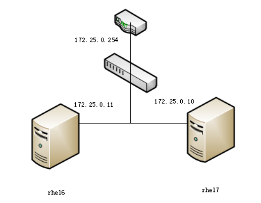
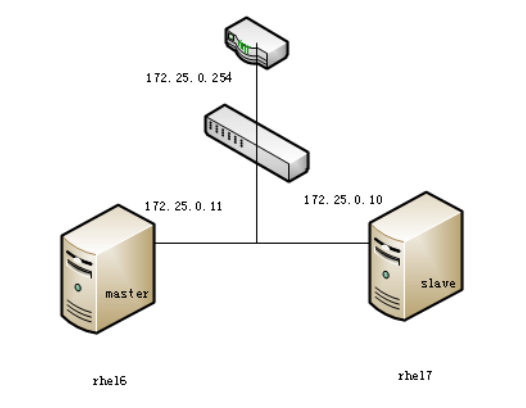
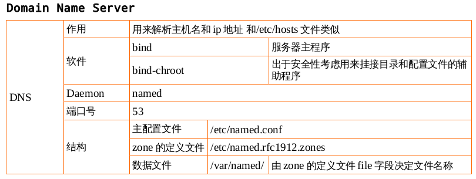

## DNS域名解析服务

[TOC]

> 课程要求
1. 在企业内部搭建一台域名解析服务器DNS正反解析
2. 在企业内部搭建两台域名解析服务器做DNS主辅同步


### DNS服务

全称是domain name server域名解析服务。

我们知道每个联网的计算机都有一个ip地址吧？Ip地址是用来做什么的呢？Ip地址是用来和互联网上别的机器进行通讯的。但是ip地址很难记吧？一两个ip地址可能还好，但是，我们每天要访问的网页不仅仅只有一两个吧？

我们记得都是什么呢？www.baidu.com. www.sina.com。我们记住的其实都是字符，都是域名。就像我们的电话号码，很难记，于是我们把电话号码存到手机里，给他起个昵称或者直接输入人名对吧，把电话号码对应成人名吧？然后打电话的时候就直接找到这个人名就好了。

所以我们系统也是一样，会把ip地址对应成一个主机名。在我们系统里有这么一个文件，就是专门用来做对应关系的，这个文件叫`/etc/hosts/`，我们可以打开来看一下，一条记录一行，行里面就是主机名和ip地址，当然一个ip地址可以对应多个主机名，就像人有很多的昵称一样。

那么这样是不是就解决问题了，当我们想要访问一个网站的时候，我们就不用输入ip地址，而是可以直接输入主机名就行了，机器会帮我们做一个解析，把主机名对应成ip地址进行通信。早期这样做的确没问题，但是随着互联网愈发的壮大，这个文件就不那么实用了。我们要在机器上配置大量的对应关系，是非常耗时，非常麻烦的，而且要配置的机器可不止一台。比如说我是百度，我希望世界上所有的人都要来访问我的网页，那么，我是不是需要让世界上所有的人都去添加我的ip地址和主机名的对应关系。这个是非常难做到的事情，工作量太大。于是我们就引入了一种新的机制。

### DNS的实现原理

这种机制的作用和hosts文件一样，但是实现方法却不一样，这个机制就叫DNS (Domain name server)。通过dns，我们可以解决这个大批量域名解析的问题。那具体是怎么实现的呢？这就是dns的结构方面的问题了。

我们之前说我们的系统是一个什么样的结构，是不是一个分层式的结构，这个结构的体现方式就是目录吧？对不对。Dns也是如此，它也采用了分层市管理的方式。

不过不同于目录，我们的目录是一个逻辑上的概念，用来帮助我们理解文件系统的一种方式。而dns，他是实实在在的一种管理结构。

那我们来看，目录的至高点是什么。是根吧，对不对，那么对于我们dns来说，既然是分层式管理结构，它也需要有一个至高点吧。这个至高点是什么呢？

我们把它称作根域，以点代表根域。全世界总共有13台根域，是处于至高无上的位置的，只有13台机器。

那么根域下面就是顶级域了，通常我们看到的顶级域有这个com。有org，有cn还有edu等等，这些都是顶级域。顶级域下面管理二级域，以此类推。

FQDN：主机名加上域名，被称作完全合格的域名，fqdn。其实com后面应该有个点的，代表根域。只不过我们现在习惯性的将其省略了。就好像国家管理省，省管理市，市管理县等等


~~~
完整的域名	www.baidu.com.
.	根域	全球一共13个根域
.com	超级域，一级域
.baidu	二级域
www	主机名
~~~

>> 举例：寻找新浪的方式。

1. 先看本地`/etc/hosts`有没有记录。
2. 找另外一个人问，-->找DNS服务器去问。 在`/etc/resolv.conf`文件中指定了找谁去问。

当然，这先后顺序也是由某个文件决定的。这个文件是`/etc/nsswitch.conf`.


Windows上面也有

网上邻居>属性>本地连接。

**DNS的两种查询方式** 对于DNS服务器，他可能知道也可能不知道，

知道的情况有两种：

1. 本地有这个域，能够解析到
2. 本地有缓存，其他人已经来问过sina是谁，那么DNS服务器可以将该结果直接返回给客户。

不知道的话就会去找自己的上级域，然后通过等待上级域的反馈，将反馈信息返回给客户端。这种方式叫做递归查询。

那么还有一种情况就是，DNS去询问上级域，然后上级域将对应的同级DNS服务器反馈回来，由客户端去询问新的DNS服务器来找寻网””址对应的IP地址。这种叫做迭代查询

~~~
www.sina.com.
1)找根域.
2)找超级域.com
3)找二级域.sina
4)成功找到www
~~~


### 实战项目1:在企业内部搭建一台域名解析服务器DNS正反解析

> 1)在rhel6上配置dns域名解析服务，解析uplooking.com域名，要求如下：
~~~
        NS      @
        A       172.25.0.11
www     A       172.25.0.10
        MX 5    mail
mail    A       172.25.0.10
ftp     A       172.25.0.10
bbs	CNAME	ftp
~~~
> 2)配置反向解析172.25.0.10和172.25.0.11；

> 3)要求rhel6和rhel7这两台服务器的域名解析服务器为172.25.0.11这台服务器。

#### 实验准备阶段

1. 画出网络拓扑图
2. 规划不同服务器需要安装的软件(os--soft版本)
3. 开始安装
4. 配置服务
5. 启动服务
6. 测试排错

> 详细步骤概览

|num|step|man|
|:--|:--|:--|
|1)|安装软件| 	bind bind-chroot|
|2)|查看软件架构|	rpm -ql |
||		日志	/var/log/named.log|
||		数据	/var/named/|
||		配置	/etc/named.conf|
|||			/etc/named.rfc1912.zones|
|3)|修改配置文件||
|4)|启动服务|
||		service	daemon|
||		named	named|
|4.1）|排除错误|	看日志|
|5)|测试|	nslookup|
|5.1）|排错|	看日志|

> 网络拓扑图



> 规划服务器软件


> 开始安装

```shell
[root@rhel6 ~]# yum install -y bind bind-chroot
Loaded plugins: product-id, refresh-packagekit, security, subscription-manager
This system is not registered to Red Hat Subscription Management. You can use subscription-manager to register.
server                                                   | 3.9 kB     00:00     
Setting up Install Process
Resolving Dependencies
--> Running transaction check
---> Package bind.x86_64 32:9.8.2-0.17.rc1.el6_4.6 will be installed
---> Package bind-chroot.x86_64 32:9.8.2-0.17.rc1.el6_4.6 will be installed
--> Finished Dependency Resolution

Dependencies Resolved

================================================================================
 Package          Arch        Version                         Repository   Size
================================================================================
Installing:
 bind             x86_64      32:9.8.2-0.17.rc1.el6_4.6       server      4.0 M
 bind-chroot      x86_64      32:9.8.2-0.17.rc1.el6_4.6       server       71 k

Transaction Summary
================================================================================
Install       2 Package(s)

Total download size: 4.0 M
Installed size: 7.3 M
Downloading Packages:
(1/2): bind-9.8.2-0.17.rc1.el6_4.6.x86_64.rpm            | 4.0 MB     00:00     
(2/2): bind-chroot-9.8.2-0.17.rc1.el6_4.6.x86_64.rpm     |  71 kB     00:00     
--------------------------------------------------------------------------------
Total                                            23 MB/s | 4.0 MB     00:00     
Running rpm_check_debug
Running Transaction Test
Transaction Test Succeeded
Running Transaction
  Installing : 32:bind-9.8.2-0.17.rc1.el6_4.6.x86_64                        1/2
  Installing : 32:bind-chroot-9.8.2-0.17.rc1.el6_4.6.x86_64                 2/2
  Verifying  : 32:bind-9.8.2-0.17.rc1.el6_4.6.x86_64                        1/2
  Verifying  : 32:bind-chroot-9.8.2-0.17.rc1.el6_4.6.x86_64                 2/2

Installed:
  bind.x86_64 32:9.8.2-0.17.rc1.el6_4.6                                         
  bind-chroot.x86_64 32:9.8.2-0.17.rc1.el6_4.6                                  

Complete!
[root@rhel6 ~]# rpm -ql bind
/etc/NetworkManager/dispatcher.d/13-named
/etc/logrotate.d/named
/etc/named
/etc/named.conf
/etc/named.iscdlv.key
/etc/named.rfc1912.zones
/etc/named.root.key
/etc/portreserve/named
/etc/rc.d/init.d/named
/etc/rndc.conf
/etc/rndc.key
/etc/sysconfig/named
/usr/lib64/bind
/usr/sbin/arpaname
/usr/sbin/ddns-confgen
/usr/sbin/dnssec-dsfromkey
/usr/sbin/dnssec-keyfromlabel
/usr/sbin/dnssec-keygen
/usr/sbin/dnssec-revoke
/usr/sbin/dnssec-settime
/usr/sbin/dnssec-signzone
/usr/sbin/genrandom
/usr/sbin/isc-hmac-fixup
/usr/sbin/lwresd
/usr/sbin/named
/usr/sbin/named-checkconf
/usr/sbin/named-checkzone
/usr/sbin/named-compilezone
/usr/sbin/named-journalprint
/usr/sbin/nsec3hash
/usr/sbin/rndc
/usr/sbin/rndc-confgen
/usr/share/doc/bind-9.8.2
... ...
/var/log/named.log
/var/named
/var/named/data
/var/named/dynamic
/var/named/named.ca
/var/named/named.empty
/var/named/named.localhost
/var/named/named.loopback
/var/named/slaves
/var/run/named
[root@rhel6 ~]# rpm -ql bind-chroot
/var/named/chroot
/var/named/chroot/dev
/var/named/chroot/dev/null
/var/named/chroot/dev/random
/var/named/chroot/dev/zero
```

> 配置文件

>> /etc/named.conf
```shell
	listen-on port 53 { any; };
	listen-on-v6 port 53 { any; };
	directory 	"/var/named";
	dump-file 	"/var/named/data/cache_dump.db";
        statistics-file "/var/named/data/named_stats.txt";
        memstatistics-file "/var/named/data/named_mem_stats.txt";
	allow-query     { any; };
```

>> /etc/named.rfc1912.zones

```shell
# 正解析
# 域名-->ip
zone "uplooking.com" IN {
        type master;
        file "named.uplooking";
        allow-update { none; };
};
# 反解析
# ip--->域名
zone "0.25.172.in-addr.arpa" IN {
        type master;
        file "named.arpa.uplooking";
        allow-update { none; };
};
```

>> /var/named/named.uplooking

```shell
$TTL 1D
@       IN SOA  @ rname.invalid. (
                                        0       ; serial
                                        1D      ; refresh
                                        1H      ; retry
                                        1W      ; expire
	                                       3H )    ; minimum
主机名	主要记录	ip
        NS      @
        A       172.25.0.11
www     A       172.25.0.10
        MX 5    mail
mail    A       172.25.0.10
ftp     A       172.25.0.10
bbs	CNAME	ftp
```
**注意** 文件的所属者和所属组以及文件的ugo权限

>> named.arpa.uplooking

```shell
$TTL 1D
@       IN SOA  @ rname.invalid. (
                                        0       ; serial
                                        1D      ; refresh
                                        1H      ; retry
                                        1W      ; expire
                                        3H )    ; minimum
        NS      uplooking.com.
11      PTR     uplooking.com.
10      PTR     www.uplooking.com.
10      PTR     mail.uplooking.com.
10      PTR     ftp.uplooking.com.
10      PTR     bbs.uplooking.com.
```
**注意：**	NS后面此时一定要将@换成域名uplooking.com.域名必须写完整的域名，带根域的

> 服务的启动

* rhel6	`service named start`
* rhel7	`systemctl start named`

> 防火墙的关闭

* rhel6	`service iptables stop`
* rhel7	`systemctl stop firewalld`

**如果服务启动不了** 那么尝试执行以下语句`rndc-confgen -a -r /etc/named.conf`

> 测试

1. `/etc/hosts`		系统管理员手动写
2. `/etc/resolv.conf`----》指定找哪个域名解析服务器`nameserver 172.25.0.11`
3. 通过`nslookup`命令

```shell

[root@rhel6 named]# nslookup
> www.uplooking.com
Server:		172.25.0.11
Address:	172.25.0.11#53

Name:	www.uplooking.com
Address: 172.25.0.10
> mail.uplooking.com
Server:		172.25.0.11
Address:	172.25.0.11#53

Name:	mail.uplooking.com
Address: 172.25.0.10
> ftp.uplooking.com
Server:		172.25.0.11
Address:	172.25.0.11#53

Name:	ftp.uplooking.com
Address: 172.25.0.10
> uplooking.com
Server:		172.25.0.11
Address:	172.25.0.11#53

Name:	uplooking.com
Address: 172.25.0.11

> bbs.uplooking.com
Server:		172.25.0.11
Address:	172.25.0.11#53

bbs.uplooking.com	canonical name = ftp.uplooking.com.
Name:	ftp.uplooking.com
Address: 172.25.0.10

> 172.25.0.10
Server:		172.25.0.11
Address:	172.25.0.11#53

10.0.25.172.in-addr.arpa	name = bbs.uplooking.com.
10.0.25.172.in-addr.arpa	name = www.uplooking.com.
10.0.25.172.in-addr.arpa	name = mail.uplooking.com.
10.0.25.172.in-addr.arpa	name = ftp.uplooking.com.
> 172.25.0.11
Server:		172.25.0.11
Address:	172.25.0.11#53

11.0.25.172.in-addr.arpa	name = uplooking.com.
> exit
```

---

### 实战项目2:在企业内部搭建两台域名解析服务器做DNS主辅同步

主辅同步：如果有数万台客户机在同一时间来访问DNS服务器，会导致服务器承受很大的压力，这时候我可能需要另外一个人来帮我分担压力，或者说如果主服务器遇到什么问题，我能有另外一个人直接顶上我的工作，这时候就可以用到一个辅助服务器了。

那么很显然，辅助服务器需要和主服务器用一样的配置，配置里写的数据也基本相同。对于我们DNS服务器来说，其实它的数据文件并不固定，对应的IP和主机名都可能会经常发生变化，那么当那个时候，我希望能够修改主机上的某一个文件的时候，从机上的文件也能够被自动被修改，保持两台机器完全同步一致。

这时候就有了一种配置方法，叫做主辅同步。

#### 实验准备阶段

1. 网络拓扑图
2. 规划软件安装bind bind-chroot
3. 修改配置文件
~~~
	#主服务器	/etc/named.rfc1912.zones	允许传输给从机
			/var/named/named.uplooking	序列号从0改成日期
			/var/named/named.arpa.uplooking 序列号从0改成日期
	#从服务器	/etc/named.conf			any
			/etc/named.rfc1912.zones	slave;masters;file
~~~
4. 启动从机服务
5. 查看从机缓冲/var/named/slaves/
6. 注意防火墙关闭
7. 客户端测试服务		

#### 具体步骤

> 网络拓扑图



> 规划软件安装


> 主服务器：

```shell
[root@rhel6 named]# vim /etc/named.rfc1912.zones
zone "uplooking.com" IN {
        type master;
        file "named.uplooking";
        allow-update { none; };
        allow-transfer { 172.25.0.10; };    	===>允许从机172.25.0.10来读取
};

zone "0.25.172.in-addr.arpa" IN {
        type master;
        file "named.arpa.uplooking";
        allow-update { none; };
        allow-transfer { 172.25.0.10; };	===>允许从机172.25.0.10来读取
};

[root@rhel6 named]# pwd
/var/named
[root@rhel6 named]# ll
total 40
drwxr-x---. 6 root  named 4096 Aug  2 10:30 chroot
drwxrwx---. 2 named named 4096 Aug  2 11:03 data
drwxrwx---. 2 named named 4096 Aug  2 15:06 dynamic
-rw-r-----. 1 root  named  271 Aug  2 13:59 named.arpa.uplooking
-rw-r-----. 1 root  named 1892 Feb 18  2008 named.ca
-rw-r-----. 1 root  named  152 Dec 15  2009 named.empty
-rw-r-----. 1 root  named  152 Jun 21  2007 named.localhost
-rw-r-----. 1 root  named  168 Dec 15  2009 named.loopback
-rw-r-----. 1 root  named  224 Aug  2 11:34 named.uplooking
drwxrwx---. 2 named named 4096 Aug 14  2013 slaves
[root@rhel6 named]# vim named.uplooking
$TTL 1D
@       IN SOA  @ rname.invalid. (
                                        20160802        ; serial
                                        1D      ; refresh
                                        1H      ; retry
                                        1W      ; expire
                                        3H )    ; minimum
        NS      @
        A       172.25.0.11
www     A       172.25.0.10
        MX 5    mail
mail    A       172.25.0.10
ftp     A       172.25.0.10
bbs     CNAME   ftp
~                        

[root@rhel6 named]# vim named.arpa.uplooking
$TTL 1D
@       IN SOA  @ rname.invalid. (
                                        20160802        ; serial
                                        1D      ; refresh
                                        1H      ; retry
                                        1W      ; expire
                                        3H )    ; minimum
        NS      uplooking.com.
11      PTR     uplooking.com.
10      PTR     www.uplooking.com.
10      PTR     mail.uplooking.com.
10      PTR     ftp.uplooking.com.
10      PTR     bbs.uplooking.com.

[root@rhel6 named]# service named restart
Stopping named: .                                          [  OK  ]
Starting named:                                            [  OK  ]
[root@rhel6 named]# service iptables stop
iptables: Firewall is not running.
[root@rhel6 named]# getenforce
Enforcing
```

> 从服务器

```shell
[root@rhel7 ~]# cat /etc/resolv.conf
# Generated by NetworkManager
domain example.com
search example.com
nameserver 172.25.254.254
[root@rhel7 ~]# yum install -y bind*
[root@rhel7 ~]# vim /etc/named.conf
[root@rhel7 ~]# vim /etc/named.rfc1912.zones
zone "uplooking.com" IN {
        type slave;				<== 定义类型为奴隶 slave
        masters { 172.25.0.11; };		<== 告诉计算机我的主人 master 是谁
        file "slaves/uploooking.com.zone";	<== 告诉计算机 zone 数据库地址在哪里,奴隶有专门的目录
        allow-update { none; };
};

zone "0.25.172.in-addr.arpa" IN {
        type slave;
        masters { 172.25.0.11; };
        file "slaves/arpa.uplooking.zone";
        allow-update { none; };
};
```

> 服务启动与关闭

```shell
[root@rhel7 ~]# systemctl stop firewalld
[root@rhel7 ~]# getenforce
Enforcing
[root@rhel7 ~]# systemctl start named
[root@rhel7 ~]# ll /var/named/slaves
total 8
-rw-r--r--. 1 named named 381 Aug  2 03:54 arpa.uplooking.zone
-rw-r--r--. 1 named named 463 Aug  2 03:54 uploooking.com.zone
```

> 测试

客户端 rhel7

```shell
[root@rhel7 ~]# vim /etc/resolv.conf
nameserver 172.25.0.11
[root@rhel7 ~]# nslookup
> www.uplooking.com
Server:		172.25.0.11
Address:	172.25.0.11#53

Name:	www.uplooking.com
Address: 172.25.0.10
> 172.25.0.10
Server:		172.25.0.11
Address:	172.25.0.11#53

10.0.25.172.in-addr.arpa	name = www.uplooking.com.
10.0.25.172.in-addr.arpa	name = mail.uplooking.com.
10.0.25.172.in-addr.arpa	name = ftp.uplooking.com.
10.0.25.172.in-addr.arpa	name = bbs.uplooking.com.
> 172.25.0.11
Server:		172.25.0.11
Address:	172.25.0.11#53

11.0.25.172.in-addr.arpa	name = uplooking.com.
> exit

[root@rhel7 ~]# vim /etc/resolv.conf
nameserver 172.25.0.10
[root@rhel7 ~]# nslookup
> www.uplooking.com
Server:		172.25.0.10
Address:	172.25.0.10#53

Name:	www.uplooking.com
Address: 172.25.0.10
> 172.25.0.11
Server:		172.25.0.10
Address:	172.25.0.10#53

11.0.25.172.in-addr.arpa	name = uplooking.com.
> 172.25.0.10
Server:		172.25.0.10
Address:	172.25.0.10#53

10.0.25.172.in-addr.arpa	name = bbs.uplooking.com.
10.0.25.172.in-addr.arpa	name = www.uplooking.com.
10.0.25.172.in-addr.arpa	name = ftp.uplooking.com.
10.0.25.172.in-addr.arpa	name = mail.uplooking.com.
> exit
```

### 排错记录

#### 服务启动不了

```shell
[root@rhel7 ~]# systemctl start named
Job for named.service failed. See 'systemctl status named.service' and 'journalctl -xn' for details.

[root@rhel7 ~]# systemctl status named.service
named.service - Berkeley Internet Name Domain (DNS)
   Loaded: loaded (/usr/lib/systemd/system/named.service; disabled)
   Active: failed (Result: exit-code) since Tue 2016-08-02 04:19:20 EDT; 23s ago
  Process: 2297 ExecStartPre=/usr/sbin/named-checkconf -z /etc/named.conf (code=exited, status=1/FAILURE)

Aug 02 04:19:20 rhel7 systemd[1]: Starting Berkeley Internet Name Domain (DNS)...
Aug 02 04:19:20 rhel7 named-checkconf[2297]: /etc/named.rfc1912.zones:51: missing ';' before '}'
Aug 02 04:19:20 rhel7 systemd[1]: named.service: control process exited, code=exited status=1
Aug 02 04:19:20 rhel7 systemd[1]: Failed to start Berkeley Internet Name Domain (DNS).
Aug 02 04:19:20 rhel7 systemd[1]: Unit named.service entered failed state.
```

ps：当服务启动不了的时候，报错内容中说我们可以通过以下两个命令来查看，`systemctl status named.service` 或者 `journalctl -xn`此时我们可以去执行以下上面命令中的任何一个，都可以看到详细的报错信息。

`Aug 02 04:19:20 rhel7 named-checkconf[2297]: /etc/named.rfc1912.zones:51: missing ';' before '}'`

这条日志告诉我们，在配置文件`/etc/named.rfc1912.zones`的第51行中，`'}'`前少了一个`';'`。因此我们根据日志中的提示去修改配置文件即可。


#### 服务启动不了

```shell
[root@rhel7 ~]# systemctl status named
named.service - Berkeley Internet Name Domain (DNS)
   Loaded: loaded (/usr/lib/systemd/system/named.service; disabled)
   Active: failed (Result: exit-code) since Tue 2016-08-02 04:50:39 EDT; 1min 42s ago
  Process: 6541 ExecStartPre=/usr/sbin/named-checkconf -z /etc/named.conf (code=exited, status=1/FAILURE)

Aug 02 04:50:39 rhel7 named-checkconf[6541]: zone 1.0.0.0.0.0.0.0.0.0.0.0.0.0.0.0.0.0.0.0.0.0.0.0.0.0.0.0...al 0
Aug 02 04:50:39 rhel7 named-checkconf[6541]: zone 1.0.0.127.in-addr.arpa/IN: loaded serial 0
Aug 02 04:50:39 rhel7 named-checkconf[6541]: zone 0.in-addr.arpa/IN: loaded serial 0
Aug 02 04:50:39 rhel7 named-checkconf[6541]: zone uplooking.com/IN: loaded serial 20160802
Aug 02 04:50:39 rhel7 named-checkconf[6541]: zone 19.25.172.in-addr.arpa/IN: loading from master file nam...ound
Aug 02 04:50:39 rhel7 named-checkconf[6541]: zone 19.25.172.in-addr.arpa/IN: not loaded due to errors.
Aug 02 04:50:39 rhel7 named-checkconf[6541]: _default/19.25.172.in-addr.arpa/IN: file not found
Aug 02 04:50:39 rhel7 systemd[1]: named.service: control process exited, code=exited status=1
Aug 02 04:50:39 rhel7 systemd[1]: Failed to start Berkeley Internet Name Domain (DNS).
Aug 02 04:50:39 rhel7 systemd[1]: Unit named.service entered failed state.
Hint: Some lines were ellipsized, use -l to show in full.


[root@rhel7 ~]# tail -n 15 /etc/named.rfc1912.zones
};

zone  "uplooking.com" IN {
        type master;
        file "named.uplooking";
        allow-update { none; };
	allow-transfer { 172.25.19.10;};
};

zone "19.25.172.in-addr.arpa" IN {
        type master;
        file "named.uplooking.arpa";
        allow-update { none; };
	allow-transfer { 172.25.19.10; };
};

[root@rhel7 ~]# ll /var/named/named*
-rw-r-----. 1 root named  330 Aug  2 04:50 /var/named/named.arpa.uplooking
-rw-r-----. 1 root named 2076 Jan 28  2013 /var/named/named.ca
-rw-r-----. 1 root named  152 Dec 15  2009 /var/named/named.empty
-rw-r-----. 1 root named  152 Jun 21  2007 /var/named/named.localhost
-rw-r-----. 1 root named  168 Dec 15  2009 /var/named/named.loopback
-rw-r-----. 1 root named  295 Aug  2 04:50 /var/named/named.uplooking
```

ps:问题出在数据文件名和配置文件中指定的数据文件名不一致。

`file "named.uplooking.arpa";`

`/var/named/named.arpa.uplooking`


#### 主辅同步缓冲文件只有一个
```shell
[root@rhel7 ~]# ll /var/named/slaves/
total 4
-rw-r--r-- 1 named named 386 Jan  1 02:46 uplooking123.zoo
```

ps:原因是`/etc/named.rfc1912.zones`中的配置有问题，指定缓冲的目录写少了一个`s`

```shell
zone \"uplooking.com\" IN {
        type slave;
        masters { 172.25.33.11; };
        file \"slave/uplooking.zone\";
        allow-update { none; };
      };
```

#### 主辅同步将从机的数据文件指定位置放在非slaves目录

从服务器的配置文件放置的位置不在slaves目录下，而在其他目录下，则同步不成功。
原因从三处排查
* 配置文件
* UGO权限
* selinux权限

此处是由于selinux的问题，我们安装一个工具`setroubleshoot`帮助我们分析
```shll
Yum search setroubleshoot
Yum -y install setroubleshoot
Sealert -a audit.log
```
看到关于布尔值的信息和关于安全上下文的信息:

* 1）设置布尔值setsebool -P named_write_master_zones 1
* 2）设置安全上下文，通过man named_selinux或者看一下slaves目录的安全上下文是什么
根据slaves的安全上下文去改。
```shell
Chcon -t named_zone_t test
Chcon -u system_u  -r object_r  test
```
然后将selinux打开，将test下的目录的同步过来的文件给删除，重启服务，看是否被同步过来。

同步成功。

#### 如果启动服务时候太慢

可以使用`/usr/sbin/rndc-confgen -a -r /etc/named.conf`

这是一个秘钥加密产生的bug

#### 有顺序的批量配置的写法：（简单了解一下）

```shell
$GENERATE 1-100 stu$   A   172.25.0.$
$GENERATE 1-200 $ PTR foundation$.ilt.example.com
```

#### 从机数据文件的查看

**7版本上无法查看**：因为从机在slaves目录下生成的配置文件是data类型的。
**6版本上可以查看**：老版本是可以查看的。

---

### 配置文件详细解析

#### 主配置文件/etc/named.conf

```shell
Options 全局的配置行   
options { //服务器的全局配置选项及一些默认设置
        listen-on port 53 { any; }; //监听端口默认监听53号端口，也可写为 { 127.0.0.1; 192.168.139.46; }
        listen-on-v6 port 53 { ::1; }; //对ip6支持
        directory       "/var/named";  //区域文件存储目录
        dump-file       "/var/named/data/cache_dump.db"; //缓存的目录directory
        statistics-file "/var/named/data/named_stats.txt";  // 状态信息文件
        memstatistics-file "/var/named/data/named_mem_stats.txt";   //内存信息文件
        pid-file        "/var/run/named/named.pid"; //存着named的pid
        forwarders     { 168.95.1.1; 139.175.10.20; }; // 如果域名服务器无法解析时，将请求交由168.95.1.1; 139.175.10.20来解析
        allow-query    { any; };   //指定允许进行查询的主机，当然是要所有的电脑都可以查啦
        allow-transfer { none; }; //指定允许接受区域传送请求的主机，说明白一点就是辅dns定义，比如辅dns的ip是192.168.139.5，那么可以这样定义{ 192.168.139.5; }，要不然主辅dns不能同步，当然，{}里的也可以用下面提到的acl。
        // those options should be used carefully because they disable port
        // randomization
        // query-source    port 53;     
        // query-source-v6 port 53;
Dnssec开头的是一些加密文件
Xxxx.key是一些秘钥文件
};
logging { //指定服务器日志记录的内容和日志信息来源
        channel default_debug {
                file "data/named.run";
                severity dynamic;
        };
};
zone "." IN { //在这个文件中是用zone关键字来定义域区的，一个zone关键字定义一个域区 
type hint; 
/*在这里type类型有三种，它们分别是master,slave和hint它们的含义分别是： 
master:表示定义的是主域名服务器 
slave :表示定义的是辅助域名服务器 
hint:表示是互联网中根域名服务器 
*/ 
Include  "/etc/named.rfc1912.conf"
Include  "/etc/named.root.key"  //两个include字段代表读取本配置文件时候同时读取/etc/named.rfc1912.conf和/etc/named.root.key文件，这里主要关注第一个文件，该文件是专门用于定义域的文件。
}
```

**`allow-query-cache`主辅同步时:**

* 6版本上必须加上 不然会报错
* 7版本不用

**`recursion`主辅同步时** 必须是yes，关掉之后会阻止新纪录进入到缓冲。


#### named.rfc1912.conf

```shell
Zone "域名 "IN {
File ;域对应的数据文件
Allow-update ;是否需要更新
}
```

**注意**

1. 所有语句结束后都需要一个分号代表结束符
2. 括号必须成对出现
3. file指向的数据文件写的是相对路径，相对于主配置文件的dirctory配置字段，即相对于/var/named目录。

**主辅同步中slave需要的配置**

```shell
Zone "域名" IN {
Type slave;
Masters { 172.25.0.11;} ;
File "slaves/test.com.zone";
}
```

#### 数据文件/var/named/named.localhost

```shell
TTL //代表周期，缓存时间，DNS会自己做缓存，1D就代表一天，缓存时间为一天。
SOA //记录  -->起始授权记录  @代表继承域名  
IN  SOA @ 用户名.域名  {
     0;serial    //序列号；一般写修改当天日期，从服务器根据该序列号来判定文件是否修改过。
     1D；refresh  // 多久做一次同步
     1H；retry    //重置时间，同步不成功时，间隔多久重新做一次同步
     1W；expire   //当重复同步不成功时，多久不再做同步。
3H；minimun  //最小缓存时间，一般是错误缓存。假设有一个人，一直问我一个错误的域名，那我就会将该错误的域名缓存下来，
当人再来问我时，我就不再搜寻，而将该结果反馈给他。

这里将serial一列改为当前日期。
}

NS代表的是正向记录  ，解析还分成正向解析和反向解析，正向解析就是知道主机名，想要搜寻IP地址。这里先来看正向解析

@代表继承域名
   NS    @
   A    127.0.0.1    
这句话代表，我的域名是localhost，localhost指向的是127.0.0.1
如果不写@而写成域名，就应该写成test.com.   Com后面必须有个点，代表根域的意思。
```
### 总结

掌握实践项目

